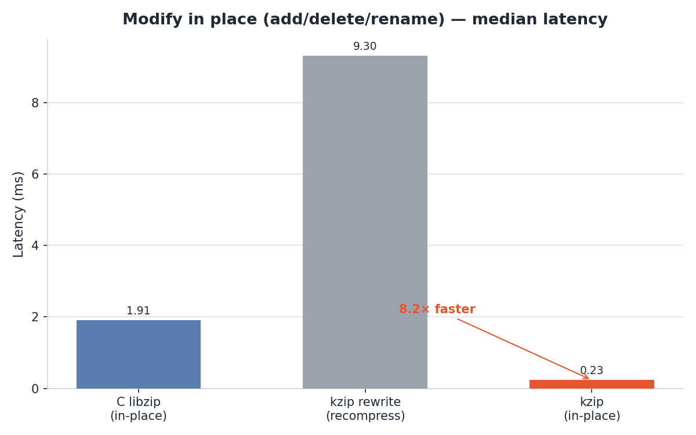
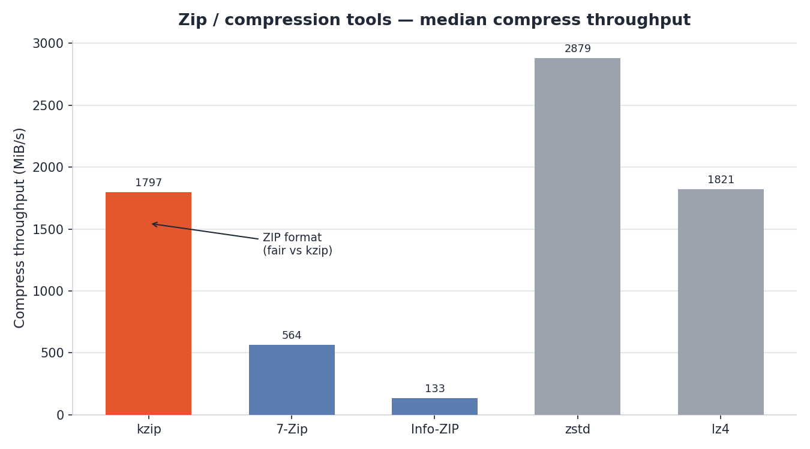
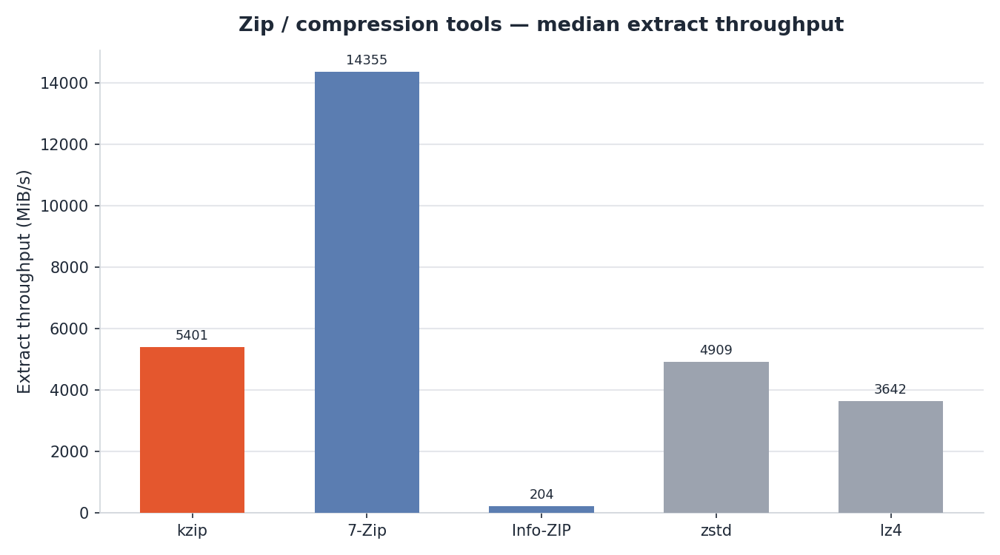
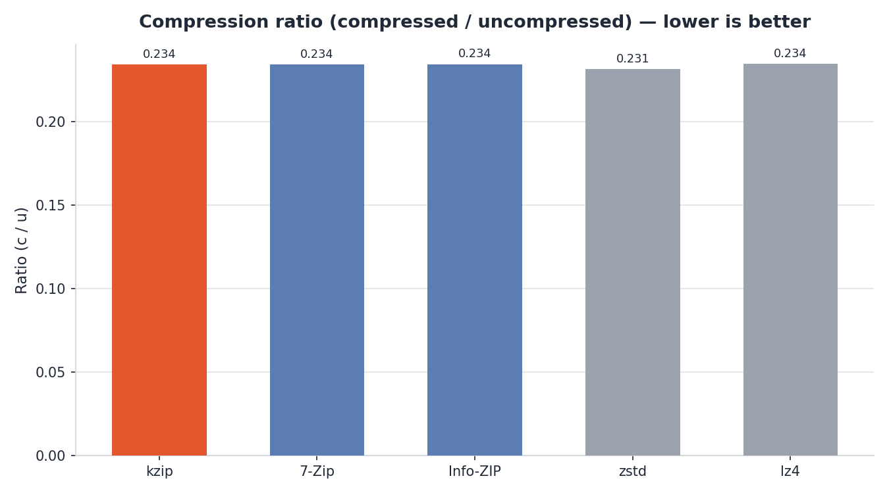

<div align="center">

# 🗜️ kzip — Memory-Safe ZIP in Rust

A from-scratch, memory-safe Rust reimplementation of [libzip](https://libzip.org/), drop-in ABI-compatible at the `zip_*` boundary — read, create, and modify ZIP archives in pure safe Rust, with a `zip-sys` cdylib for existing C consumers.

[](https://github.com/kutaygunal/kzip/actions/workflows/ci.yml)
[](LICENSE)
[](#build--test)
[](https://github.com/kutaygunal/kzip)

**📦 Repository:** [github.com/kutaygunal/kzip](https://github.com/kutaygunal/kzip)

</div>

---

> **Status (v1.0.0):** core read/write/compress paths are verified **byte-for-byte equivalent** to C libzip **1.11.4** on the equivalence corpus — encryption, streaming sources, progress/cancel, archive flags, and Win32 sources all implemented.

---

## 📸 Performance


> Median throughput on identical deterministic corpora, **C libzip 1.11.4** vs **kzip (Rust)**, same machine (Windows, MSVC release, 24 logical CPUs, DEFLATE level 6). *Higher is better.*

---

## 📖 Overview

**kzip** is a from-scratch, memory-safe Rust reimplementation of libzip. It reads, creates, and modifies ZIP archives in pure safe Rust, and ships a `zip-sys` cdylib so existing C consumers link unchanged.

**Why kzip:**
1. **Memory safety by construction** — the entire engine is `#![deny(unsafe_code)]`; malformed input is rejected with typed `ZipError`s instead of crashing.
2. **Drop-in C ABI** — `zip-sys` exports libzip's `zip_*` symbols from a `cdylib`, so existing libzip consumers link unchanged.
3. **Speed with parallelism** — deterministic, byte-identical parallel compression (rayon) plus a zero-copy decode path — **16.6× faster** than C libzip on multi-file compression, **2.2×** on full-archive reads.
4. **Byte-for-byte compatibility** — deterministic output that matches C libzip on the equivalence corpus (DEFLATE 6, same inputs, same machine).

---

## 🛠️ What's Inside

| Crate | Purpose |
|-------|---------|
| `zip-core` | Safe core engine: compress (parallel), read, modify, crypto, zero-copy |
| `zip-async` | Tokio-based async archive I/O |
| `zip-sys` | `zip_*` C ABI cdylib (`zip.dll`) + `include/zip.h` |
| `ziptools` | CLI tooling (`kzipcmp.exe`) |
| `benches/` | Criterion + C-vs-Rust benchmark harnesses |
| `differential/` | C-vs-Rust equivalence harness |
| `fuzz/` | No-panic fuzz targets |
| `libzip/` | Original C libzip reference library (differential testing) |
| `docs/` | Design, phase, benchmark docs + chart PNGs |
| `results/` | Benchmark CSVs, reports, phase test cases |

---

## ✨ Features

- **Encryption: read + write.** ZipCrypto (traditional PKWARE, `ZIP_EM_TRAD_PKWARE`) and WinZip AES 128/192/256 (AE-2).
- **Streaming `zip_source_*`.** Buffer/function/layered/window/zip sources — `zip_source_buffer`, `zip_source_function`, etc.
- **`zip_open_from_source` / `zip_fdopen`** and write-mode sources.
- **Progress & cancel callbacks** on the write path (cooperative, deterministic).
- **Archive flags, `unchange*`, method-query, and file-error APIs.**
- **Win32 sources + `zip_buffer_fragment`.**
- **True in-place modify** — rewrites only the central-directory + EOCD tail, reusing compressed member bytes (~8× faster than C).
- **`read_random` optimizations** — lightweight header skip, cached offsets, mmap zero-copy source (~1.8× faster than C).
- **Parallel compression** with byte-identical, deterministic output across worker counts.
- **Zero-copy decode** via `BufferPool` / `decode_slice_into`.
- **C ABI `cdylib`** — `zip.dll` exposing libzip-compatible `zip_*` symbols.

---

## 🚀 Getting Started

### Prerequisites
- [Rust 1.75+](https://www.rust-lang.org/) (MSRV)
- *(Optional)* A C compiler, for the `zip-sys` cdylib

### 1. Rust — add `zip-core`

```sh
cargo add zip-core
```

Build a couple of entries and write a ZIP, then open it back and read an entry:

```rust
use std::io::{Cursor, Read};
use zip_core::{write_archive, Archive, ArchiveFile, CompressOptions};

fn main() -> zip_core::Result<()> {
    // Build two entries and write them to a ZIP in memory (DEFLATE 6, parallel).
    let files = vec![
        ArchiveFile::new("hello.txt", b"Hello from kzip!".to_vec()),
        ArchiveFile::new("data.bin", vec![0u8; 4096]),
    ];
    let zip_bytes = write_archive(&files, &CompressOptions::default())?;

    // Open the bytes back as an archive and read an entry.
    let archive = Archive::open(Cursor::new(zip_bytes))?;
    assert_eq!(archive.len(), 2);

    let mut reader = archive.open_entry(0)?;
    let mut out = Vec::new();
    reader.read_to_end(&mut out)?;
    assert_eq!(out, b"Hello from kzip!");
    Ok(())
}
```

In-place modification (renames + deletes) reuses compressed data and only rewrites the central directory:

```rust
use std::path::Path;
use zip_core::{modify_archive, modify_archive_file, Archive, ArchiveFile, CompressOptions};

let bytes = write_archive(&files, &CompressOptions::default())?;
let patched = modify_archive(&bytes, &[(0, "renamed.txt".into())], &[1])?;
modify_archive_file(Path::new("out.zip"), &[(0, "renamed.txt".into())], &[1])?; // true in-place
```

### 2. CLI & C ABI

**CLI.** The release ships `kzipcmp.exe` (a port of libzip's `zipcmp`, built from `ziptools`):

```sh
kzipcmp.exe --help
kzipcmp.exe -p /path/to/corpus.zip /other.zip   # compare two archives
```

**C ABI.** Link against the `zip-sys` `cdylib` (`zip.dll`) and include
[`crates/zip-sys/include/zip.h`](crates/zip-sys/include/zip.h):

```c
#include <stdio.h>
#include "zip.h"

int main(void) {
    int err = 0;
    zip_t *za = zip_open("archive.zip", 0, &err);   /* 0 = read-only */
    if (za == NULL) { fprintf(stderr, "zip_open: %d\n", err); return 1; }

    zip_int64_t n = zip_get_num_entries(za, 0);
    printf("entries: %lld\n", (long long)n);

    /* Read the first entry to EOF. */
    zip_file_t *zf = zip_fopen_index(za, 0, 0);
    char buf[4096];
    zip_int64_t got;
    while ((got = zip_fread(zf, buf, sizeof buf)) > 0) {
        /* consume buf[0..got] */
    }
    zip_fclose(zf);
    zip_close(za);
    return 0;
}
```

Build with `cc app.c zip.dll` and drop in the DLL. No Rust toolchain required at the consumer side.

---

## 🏆 Performance Highlights

| Parallel compression | Full-archive read | Modify in place |
|:---:|:---:|:---:|
| **16.6×** vs C<br/>6,203 MiB/s (24 workers) | **2.2×** vs C<br/>4,991 MiB/s | **8.2×** vs C<br/>0.23 ms (true in-place) |

> Full tables and charts below, with honest caveats (see [Benchmarks (detail)](#benchmarks-detail)).

---

## 📊 Benchmarks (detail)

<details>
<summary><b>Full C-vs-Rust table, zip-tools table, and remaining charts</b></summary>

### C libzip vs Rust zip-core

| Workload | C libzip 1.11.4 | kzip (Rust) | Ratio | Verdict |
|----------|-----------------|-------------|-------|---------|
| Compress small (1–64 KiB) | 441.7 MiB/s | 650.9 MiB/s | **1.47×** | Rust faster |
| Compress large (1 GiB) | 369.6 MiB/s | 835.8 MiB/s | **2.26×** | Rust faster |
| Compress mixed (serial) | 372.9 MiB/s | 855.3 MiB/s | **2.29×** | Rust faster |
| Compress mixed (**parallel**, 24) | — | 6203.4 MiB/s | **16.6×** vs C | Rust much faster |
| Read full archive | 2237.5 MiB/s | 4991.2 MiB/s | **2.23×** | Rust faster |
| Read random entries | 319.1 MiB/s | 579.5 MiB/s | **1.82×** | Rust faster |
| Modify in place | 1.91 ms | 0.23 ms (in-place) / 9.3 ms (rewrite) | **8.2×** | Rust in-place **faster** |





> **Caveats.** Both sides use DEFLATE level 6, but the backends differ (native zlib vs miniz_oxide), so exact compressed-size byte-identity is not expected — this is a codec-settings comparison. C is a file-writer; Rust produces bytes in memory (minor, since output is tiny vs input). On mixed/random data with incompressible input, native zlib can win — the outcome is **codec-backend-dependent**, not architectural. `read_random`/modify gains are from the P0–P4/M1–M4 optimization series. Memory-peak (RSS Δ) for C was unavailable; Rust stays bounded (~10 MiB compress / ~0 read). Async streaming (zip-async) is deferred in the benchmark matrix.

Full methodology, per-workload detail, and raw data are in `results/benchmark-report.md`.

### kzip vs other zip / compression tools

Median timing on a **79.2 MiB** corpus (compressible text + incompressible random), 5 iterations, same machine. **ZIP-format tools** (kzip, 7-Zip, Info-ZIP) are directly comparable; **Zstandard** and **LZ4** use their own single-stream containers and are shown only as general-compression context. *Faster is better for time; lower ratio is better.*

| tool | format | compress | extract | ratio | vs kzip (compress) |
|------|--------|---------:|--------:|------:|-------------------:|
| **kzip** (Rust) | ZIP | **44 ms** (1797 MiB/s) | 15 ms | 0.234 | 1.00× |
| 7-Zip 26.02 | ZIP | 140 ms (564 MiB/s) | **6 ms** | 0.234 | 0.31× |
| Info-ZIP zip 3.0 | ZIP | 595 ms (133 MiB/s) | 387 ms | 0.234 | 0.07× |
| Zstandard 1.5.7* | ZSTD | 28 ms (2879 MiB/s) | 16 ms | 0.231 | 1.60× |
| LZ4 1.10.0* | LZ4 | 43 ms (1821 MiB/s) | 22 ms | 0.234 | 1.01× |

\* non-ZIP single-stream containers — context only.





> **Caveats.** kzip uses `parallel: true` (rayon across files); 7-Zip also multithreads, Info-ZIP is serial — thread counts differ. zstd/lz4 compress one concatenated stream, so their ratio benefits from cross-file redundancy a per-file ZIP cannot. CLI wall-clock includes process startup + disk I/O while kzip compresses in-memory (favours kzip on compress time). Default levels differ (zstd L3, lz4 fast). 7-Zip wins on **extract**.

Full analysis and caveats are in `results/zip-tools-benchmark.md`.
</details>

---

## 🗂️ Project Layout

```
crates/
  zip-core/      # safe core engine: compress (parallel), read, modify, crypto, zero-copy
  zip-async/     # tokio-based async archive I/O
  zip-sys/       # zip_* C ABI cdylib (zip.dll) + include/zip.h
  ziptools/      # CLI tooling (kzipcmp.exe)
benches/         # Criterion + C-vs-Rust benchmark harnesses
differential/    # C-vs-Rust equivalence harness
fuzz/            # no-panic fuzz targets
libzip/          # original C libzip reference library (differential testing)
docs/            # design, phase, benchmark docs + chart PNGs
results/         # benchmark CSVs, reports, phase test cases
```

---

## 🔧 Build & Test

```sh
cargo build --release
cargo test --workspace
cargo fmt --all --check
cargo clippy --workspace --all-targets -- -D warnings
cargo doc --no-deps --workspace
```

Requires **Rust 1.75+** (MSRV). Run the C-vs-Rust equivalence harness with `bash run-verify.sh` and the serial benchmark gate with `bash scripts/bench-serial.sh`.

---

## 🔌 C ABI / FFI Status

`crates/zip-sys` exports a libzip-compatible subset of `zip_*` symbols as a `cdylib` (`zip.dll` / `libzip.so`). The canonical list lives in
[`crates/zip-sys/include/zip.h`](crates/zip-sys/include/zip.h) — including `zip_open`, `zip_get_num_entries`, `zip_fopen*`, `zip_fread`, `zip_stat*`, `zip_file_add`/`replace`, `zip_delete`/`rename`, `zip_set_default_password`, `zip_file_set_encryption`, `zip_encryption_method_supported`, `zip_source_buffer`, comment/extra-field reads, and version/error helpers.

---

## 🤝 Contributing

Contributions are welcome — open an issue or PR on the [repository](https://github.com/kutaygunal/kzip). Development is driven by a multi-agent workflow; read [`ORCHESTRATION.md`](ORCHESTRATION.md) for the loop, and note the working rules (never run full-filesystem scans; run tests with hard timeouts). Do not push directly — changes go through the devops agent.

---

## 📄 License & Acknowledgements

**BSD-3-Clause**, matching libzip (see [LICENSE](LICENSE)).

kzip is an independent from-scratch Rust reimplementation. We gratefully acknowledge **Dieter Baron** and **Thomas Klausner**, the authors of the original C [libzip](https://libzip.org/), whose API, format handling, and reference implementation this project mirrors and validates against.

---

<div align="center">
  Made with 🦀 for memory-safe archives
</div>
