# kzip

`kzip` is an independent Rust implementation of the core ideas and public ZIP
workflow of [libzip](https://libzip.org/). It can read, create, inspect, and
modify ZIP archives, and it provides both an idiomatic Rust API and a
libzip-shaped C ABI layer.

This is a compatibility-oriented project, not a claim that the Rust library is
the original libzip or a complete replacement for every libzip release.

## What is in the repository

| Crate | Role |
| --- | --- |
| `zip-core` | Safe Rust engine for ZIP parsing, reading, writing, editing, codecs, and encryption. |
| `zip-async` | Tokio adapter for asynchronous archive entry reads. |
| `zip-sys` | `cdylib` exposing the implemented `zip_*` C ABI surface and `zip.h`. |
| `ziptools` | Rust archive comparison tool, including the `zipcmp`-style CLI. |
| `differential` | Verification harness that compares the Rust ABI with a C libzip build. |
| `fuzz` | Standalone cargo-fuzz targets for malformed archive and codec input. |

## Features

- Read and write standard ZIP archives, including stored and DEFLATE entries.
- Bzip2 decoding through the Rust codec layer.
- ZIP64 reading, central-directory validation, CRC/size checks, and typed errors.
- ZipCrypto and WinZip AES-128, AES-192, and AES-256 read/write support.
- Archive editing: add, replace, delete, rename, comments, extra fields, and
  metadata through the supported APIs.
- Optional deterministic parallel compression of independent files.
- Zero-copy-friendly sources, buffer reuse, memory mapping, and a Tokio read
  adapter.
- A C ABI layer for applications that use the supported subset of libzip's
  `zip_*` API.

## Why this exists

This project is heavily inspired by the recent [Bun Zig-to-Rust rewrite](https://github.com/oven-sh/bun/pull/30412): preserve the behavior and architecture of a systems project while moving the implementation toward Rust's ownership model and compiler-assisted safety. The porting mindset here is similar—map the original API, keep compatibility evidence close to the code, and use the original implementation as the behavioral oracle.

This repository is openly **vibe-coded**. AI-assisted generation was part of
the implementation process. The practical contract is therefore the one
enforced by compilation, tests, fuzz/robustness checks, and C-vs-Rust
differential verification—not an assumption that generated code is correct by
itself.

The core crate is written with `#![deny(unsafe_code)]`. The FFI crate necessarily
contains the unsafe boundary required to expose C pointers and handles.

## Rust example

```rust
use std::io::{Cursor, Read};
use zip_core::{write_archive, Archive, ArchiveFile, CompressOptions, Result};

fn main() -> Result<()> {
    let files = vec![
        ArchiveFile::new("hello.txt", b"Hello from kzip".to_vec()),
        ArchiveFile::new("data.bin", vec![0; 4096]),
    ];

    let bytes = write_archive(&files, &CompressOptions::default())?;
    let archive = Archive::open(Cursor::new(bytes))?;

    let mut reader = archive.open_entry(0)?;
    let mut output = Vec::new();
    reader.read_to_end(&mut output)?;
    assert_eq!(output, b"Hello from kzip");
    Ok(())
}
```

Add the core crate to an application with:

```sh
cargo add zip-core
```

For file-level changes, `modify_archive` returns modified bytes and
`modify_archive_file` updates an archive on disk while reusing existing member
data where possible. The migration guide maps common libzip calls to their Rust
counterparts: [`docs/migration.md`](docs/migration.md).

## kzip compared with libzip

The local reference used by this repository is C libzip **1.11.4**. The
comparison below describes capabilities, not runtime speed:

| Area | Original libzip | kzip |
| --- | --- | --- |
| Implementation | Portable C library with its complete public C API. | Rust workspace with `zip-core`, an async adapter, tools, and an FFI layer. |
| Rust API | Not applicable. | Ownership-based `Result` API over `Read`/`Seek` sources. |
| C API | Full libzip API for the release. | The DLL exports the 128 enumerated C functions; the shipped header is still being expanded to declare the complete surface. |
| Archive operations | Read, create, modify, revert, and close/write. | Read, create, modify, comments, metadata, and supported revert/edit operations. |
| ZIP formats | ZIP and ZIP64 read/write. | ZIP and ZIP64 read/write, including ZIP64 entry counts, overflowing sizes, offsets, and AES data descriptors. |
| Codecs | Store, DEFLATE, Bzip2, LZMA, and Zstandard when configured. | Store, DEFLATE, and Bzip2; LZMA and Zstandard are not currently implemented. |
| Encryption | Traditional PKWARE encryption and WinZip AES. | Traditional PKWARE encryption and WinZip AES-128/192/256. |
| Sources | Broad `zip_source_*` family, including file, callback, layered, and window sources. | Rust `Source` abstractions and the implemented `zip-sys` source functions; not every libzip source symbol is exported. |
| Parallelism | Library API is primarily synchronous; applications choose their own concurrency. | Optional Rayon-based parallel compression with deterministic archive ordering. |
| Safety model | C callers own memory and handle lifetime. | Safe core APIs; C callers still need normal FFI ownership and lifetime discipline. |

Known ABI differences are intentionally documented rather than hidden. The
compatibility layer still differs from a complete libzip build in optional
codec availability, some backend-specific flags, and the breadth of source
constructors. Treat `zip-sys` as a supported subset and use the shipped header
as the exact symbol contract.

## Benchmark snapshot

The benchmark runner compares the original C libzip DLL and the Rust DLL
through the same C ABI. It uses deterministic workloads, two warmup rounds,
seven measured samples, median/p95 latency, throughput, and checksum
validation for every archive read. Higher bars mean more MiB/s.



There is also a [static version of the chart](docs/benchmarks/benchmark.svg)
for renderers that do not animate SVG. This snapshot was captured on Windows
x86_64 with Rust 1.97.1 and libzip 1.11.4. It is a machine-specific snapshot,
not a universal performance claim.

### What the snapshot says

- Rust won 9 of 10 write rows in this run; mixed DEFLATE was the exception.
- Rust also won all 10 read rows after the read-path optimization. The
  many-small Store case improved from roughly 7 MiB/s to 805 MiB/s, versus
  385 MiB/s for C.
- The benchmark validates content checksums while timing, so a fast incorrect
  archive cannot score as a win.

### Bottleneck analysis and fixes

The original Rust read path eagerly decoded each entry into a new `Vec`, then
copied it again through `zip_fread`. That was especially expensive for 1,024
small Store entries. Read-only opens now use mmap, Store readers reference
shared immutable archive bytes directly, and DEFLATE entries stream through the
decoder (using the pooled fast path or streaming fallback) instead of calling
`read_entry` and then copying through the FFI handle. The write path also avoids
a second copy when `zip_file_add` consumes a plain buffer source and
preallocates bounded DEFLATE output capacity. The optimized snapshot beats C in 19 of 20
rows; the only remaining miss is mixed DEFLATE write, where this run measured
85.2 MiB/s Rust versus 86.8 MiB/s C.

<details>
<summary>Exact median throughput from the captured run</summary>

| Operation | Method | Workload | libzip C | kzip Rust | Faster |
| --- | --- | --- | ---: | ---: | --- |
| write | Store | tiny-mixed | 16.7 | 19.9 | Rust |
| read | Store | tiny-mixed | 386.5 | 606.4 | Rust |
| write | DEFLATE | tiny-mixed | 27.2 | 42.3 | Rust |
| read | DEFLATE | tiny-mixed | 312.5 | 427.5 | Rust |
| write | Store | many-small | 106.4 | 255.9 | Rust |
| read | Store | many-small | 385.4 | 804.9 | Rust |
| write | DEFLATE | many-small | 101.5 | 176.9 | Rust |
| read | DEFLATE | many-small | 333.4 | 509.6 | Rust |
| write | Store | text-8m | 410.2 | 713.3 | Rust |
| read | Store | text-8m | 681.4 | 879.3 | Rust |
| write | DEFLATE | text-8m | 214.9 | 546.3 | Rust |
| read | DEFLATE | text-8m | 641.1 | 974.1 | Rust |
| write | Store | mixed-8m | 382.2 | 691.1 | Rust |
| read | Store | mixed-8m | 624.0 | 831.1 | Rust |
| write | DEFLATE | mixed-8m | 86.8 | 85.2 | C |
| read | DEFLATE | mixed-8m | 535.4 | 894.9 | Rust |
| write | Store | single-16m | 507.9 | 826.3 | Rust |
| read | Store | single-16m | 628.6 | 756.5 | Rust |
| write | DEFLATE | single-16m | 195.6 | 502.0 | Rust |
| read | DEFLATE | single-16m | 636.0 | 910.6 | Rust |

Throughput is MiB/s; the underlying JSON also preserves p95 latency and all
individual samples.

</details>

### Reproduce it

```powershell
cargo build --release -p differential -p zip-sys
cargo run --release -p differential --bin benchmark -- `
  libs/c/zip.dll target/release/zip.dll `
  results/benchmark-$(Get-Date -Format yyyy-MM-dd).json `
  --samples 7 --warmups 2
python benchmarks/render.py `
  results/benchmark-$(Get-Date -Format yyyy-MM-dd).json `
  docs/benchmarks/benchmark.svg docs/benchmarks/benchmark-animation.svg
```

The runner covers tiny mixed files, many small files, compressible text,
mixed compressibility, and a single large file across Store and DEFLATE read
and write paths. The raw run is preserved in
[`results/benchmark-2026-08-12.json`](results/benchmark-2026-08-12.json), and
the renderer is [`benchmarks/render.py`](benchmarks/render.py).

## Comparing behavior with the original C library

The repository includes a differential harness for behavioral verification. It
compares read/stat/error results and performs cross-reading of archives written
by each implementation. Timing is not treated as evidence of correctness.

The verification workflow expects a C libzip 1.11.4 DLL at
`libs/c/zip.dll` and Bash on the path:

```sh
cargo test --workspace
bash run-verify.sh
```

The normal Rust checks are:

```sh
cargo build --workspace
cargo test --workspace
cargo fmt --all --check
cargo clippy --workspace --all-targets -- -D warnings
cargo doc --no-deps --workspace
```

The detailed capability mapping is in [`docs/support-matrix.md`](docs/support-matrix.md),
the C ABI declaration is [`crates/zip-sys/include/zip.h`](crates/zip-sys/include/zip.h),
and the differential-test notes are in [`docs/regress.md`](docs/regress.md).

## Project status

The project is under active development. The most important compatibility work
is tracked in source tests and the differential harness. APIs may change before
the crates are considered stable; `zip-core` is currently the only crate
intended for publication.

## License

BSD-3-Clause. See [`LICENSE`](LICENSE). kzip is an independent implementation
that acknowledges the libzip project and its authors, Dieter Baron and Thomas
Klausner.
