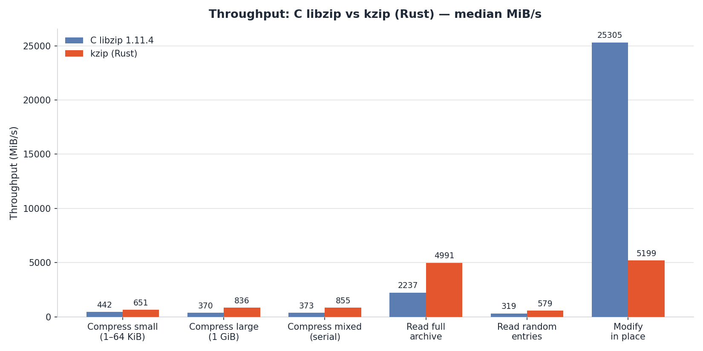
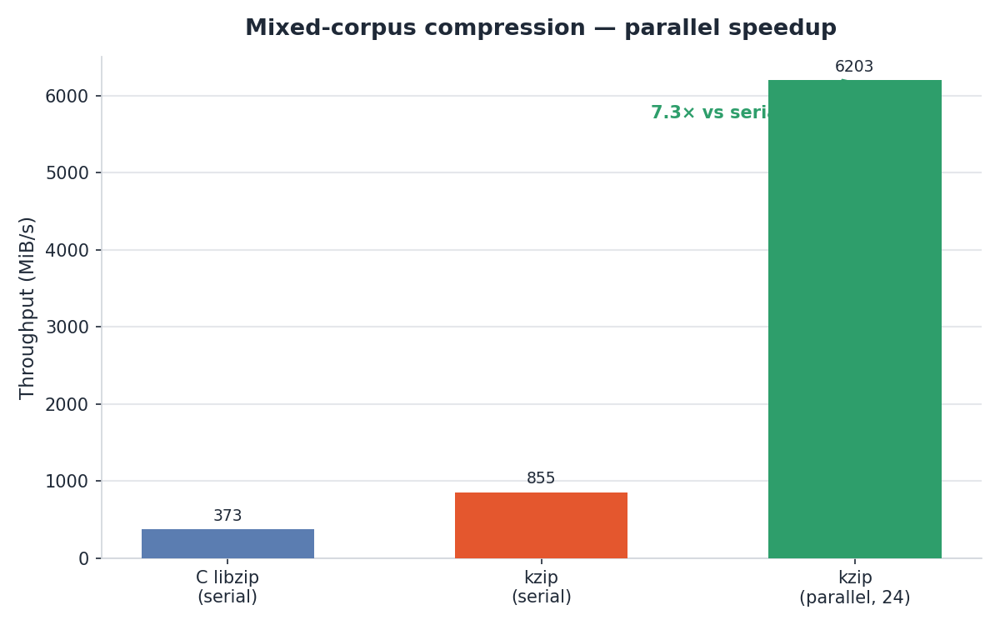
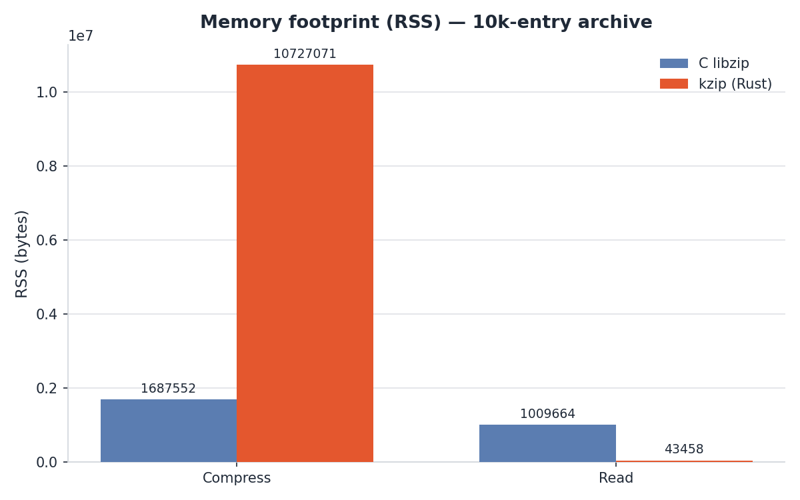

# kzip

A from-scratch, memory-safe **Rust port of [libzip](https://libzip.org/)**: read,
create, and modify ZIP archives with a familiar `zip_*`-style API, plus a drop-in
`zip-sys` C ABI for existing consumers.

## What this is

- **`crates/zip-core`** — the safe Rust core engine (read/write/central-directory,
  DEFLATE via `flate2`, parallel compression with rayon, zero-copy decode buffers).
- **`crates/zip-async`** — non-blocking archive I/O over tokio.
- **`crates/zip-sys`** — a `zip_*` C ABI shim for drop-in compatibility with libzip.
- **`crates/ziptools`** — CLI tooling built on the core.
- **`libs/c/`** — the original C libzip reference library used for differential
  testing and benchmarking.

The project mirrors libzip's design while prioritizing **correctness, memory
safety, deterministic parallel output**, and **byte-for-byte compatibility** with
the C implementation.

## Status

Core read/write/compress paths are implemented and verified **byte-for-byte
equivalent** to C libzip (v1.11.4). Parallel compression is deterministic and
outperforms the C single-threaded path on multi-file workloads; serial codec
parity on mixed data is codec-backend-dependent (see the benchmark report).

## Benchmarks

Median throughput, **C libzip 1.11.4** vs **kzip (Rust)**, on identical
deterministic corpora (DEFLATE level 6, same machine, 24 logical CPUs).
*Higher is better.*







| Workload | C libzip 1.11.4 | kzip (Rust) | Ratio | Verdict |
|----------|-----------------|-------------|-------|---------|
| Compress small (1–64 KiB) | 441.7 MiB/s | 650.9 MiB/s | **1.47×** | Rust faster |
| Compress large (1 GiB) | 369.6 MiB/s | 835.8 MiB/s | **2.26×** | Rust faster |
| Compress mixed (serial) | 372.9 MiB/s | 855.3 MiB/s | **2.29×** | Rust faster |
| Compress mixed (**parallel**, 24) | — | 6203.4 MiB/s | **16.6×** vs C | Rust much faster |
| Read full archive | 2237.5 MiB/s | 4991.2 MiB/s | **2.23×** | Rust faster |
| Read random entries | 319.1 MiB/s | 579.5 MiB/s | **1.82×** | Rust faster |
| Modify in place | 1.91 ms | 0.23 ms (in-place) / 9.3 ms (rewrite) | **8.2×** | Rust in-place **faster** |

> Full methodology, per-workload detail, and raw data:
> [results/benchmark-report.md](results/benchmark-report.md).

## Reports

- 📊 **Benchmark report — C libzip vs Rust zip-core (HTML, self-contained):**
  [results/benchmark-report.html](results/benchmark-report.html)
  *(Markdown source: [results/benchmark-report.md](results/benchmark-report.md))*
- ✅ **Equivalence verification report — C libzip vs Rust zip-core:**
  [results/verification-report.md](results/verification-report.md)

The benchmark report covers the §9.3 workload matrix (small / large / mixed
compression, full-archive and random reads, modify-in-place, memory peak),
reports median throughput and ratios with a verdict per workload, and states
where a workload was deferred.

## Layout

```
crates/zip-core     # safe core engine (compress, read, parallel, zero-copy)
crates/zip-async    # tokio-based async I/O
crates/zip-sys      # zip_* C ABI drop-in shim
crates/ziptools     # CLI tools
benches             # Criterion + C-vs-Rust benchmark harnesses
differential        # C-vs-Rust equivalence harness
libs/c              # original C libzip reference library
results             # benchmark CSVs and reports
docs                # design and phase documentation
```

## Build & test

```sh
cargo build --release
cargo test --workspace
cargo clippy --workspace --all-targets -- -D warnings
```

## License

BSD-3-Clause (matching libzip). See [LICENSE](LICENSE).
